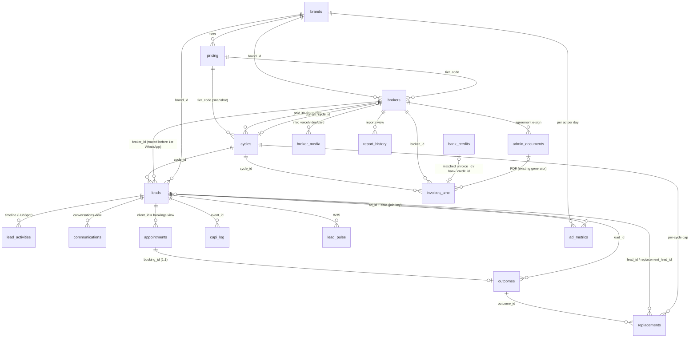

# SortMyCover schema (P2-SCHEMA) — drafted, NOT applied

**Owner:** platform-architect · **Date:** 2026-10-02 · **Status:** migration files only. Nothing is applied to project `cmsylaupctrbsvzrgzwy` until NH-11 (live schema dump) has been diffed and NH-15 is a yes.
**Files:** `supabase/migrations/20261002_smc_01_security.sql` … `20261002_smc_05_rls.sql`, `supabase/seed/smc_synthetic.sql`, `deliverables/platform-architect/security-runbook.md`.
**Rule:** these migrations are additive and extend the existing CRM (0.2, pre-mortem #8). They create new objects only where `build/crm-gap.md` says **new**. SortMyCover rows are those with `brand_id IS NOT NULL`; legacy B2B rows keep `brand_id = NULL`. Adding broker #2 needs one `brokers` row and one `cycles` row. There are no new tables, no new columns and no tenant abstraction (true north).

## Validation performed (local only)
- A **throwaway local PostgreSQL 16** was used, with a Supabase stub: roles `anon`, `authenticated` and `service_role`; `auth.uid()`; `storage.*`; the `extensions` schema; the realtime publication; and Supabase-style default grants.
- All 60 legacy repo migrations were replayed first. That gives 25 legacy tables; the pg_cron migration was skipped because the extension is absent locally.
- Migrations 01→05 were then applied **twice**. Both passes had zero errors, so every statement is idempotent.
- The seed was then applied twice. Without `SET smc.allow_synthetic='on'` it aborts.
- RLS and behaviour checks:
  - **Broker isolation.** A second broker sees 0 leads, messages, cycles and outcomes, and broker 1 sees only his own 10.
  - **Broker write limits.** A broker cannot update SMC lead fields or `brokers.status`.
  - **anon.** Denied on leads, on outcomes and on `smc_erase_lead`.
  - **n8n_app.** Sees SMC rows only, cannot DELETE, cannot write `audit_log`, and can run `smc_erase_lead`.
  - **facts_reader.** Reads `facts.*` and is denied on `public.leads`.
  - **Bookings.** The overlap exclusion constraint rejects a double booking.
  - **Audit log.** It stores `phone` as `[redacted]`.
- `facts.v_watchlist` returns all 7 metrics from the synthetic cycle.
- `node -e` structural checks on all 6 files found:
  - balanced `$$` quotes and parentheses;
  - no `CREATE TABLE|INDEX|SCHEMA|EXTENSION` without `IF NOT EXISTS`;
  - every `CREATE POLICY` inside a `pg_policies` guard;
  - every `CREATE TRIGGER` preceded by `DROP TRIGGER IF EXISTS`;
  - no `DROP TABLE|COLUMN|VIEW|FUNCTION|SCHEMA`;
  - no `public.invoices`, `public.proposals` or `public.notifications`.
- The local cluster lived outside the repo and was deleted afterwards. The live project was never touched, and Supabase MCP was not used.
- **Not validated:** the real Supabase platform (it may differ from the stub) and the live schema (NH-11).

## ERD (core path; ops/facts omitted for readability)

Every write to the tables above (SMC rows only on shared tables) lands in `audit_log` via the `smc_audit()` trigger.

## Name mapping (4.6 / prompt name → what the CRM calls it)
| Prompt name | Physical object | Why |
|---|---|---|
| `brand_id`, `broker_id`, `cycle_id` | `brands.id`, `brokers.id`, `cycles.id` | Repo convention (`id` PK) |
| `practice_name` / `adviser_name` / `adviser_whatsapp` / `calendar_id` | `brokers.firm_name` / `contact_person` / `whatsapp_number` / `calendar_email` | Existing UI reads them (crm-gap A1) |
| `active` | `brokers.active` (generated: `status = 'active'`) | 4.6 flag without a second source of truth |
| `mobile` | `leads.phone` (E.164) | Existing NOT NULL column |
| `event_id` (browser) | `leads.lead_event_id` | Name in `automation/capi/event-spec.md` (cross-agent contract); avoids clash with `capi_log.event_id` |
| `bond`, `dependants`, `work_cover`, `method_pref` | same names (booleans / text) | Task brief; crm-gap's `has_bond`/`has_dependants`/`preferred_method` superseded |
| `consent_mode` (lead) | `leads.consent_mode` = mode in force at capture | crm-gap's `consent_mode_at_capture` |
| `conversations` | view over `communications` (`brand_id` not null) | crm-gap A1: extend INV-T14 |
| `bookings` (`lead_id`, `starts_at`, `source`) | view over `appointments` (`client_id`, `appointment_date`, `booked_via`) | crm-gap A1: extend INV-T24 |
| `reports` (`payload_json`) | view over `report_history` (`report_data`) | crm-gap A3: extend INV-T21 |
| `invoices` | `invoices_smc` | Possible live `public.invoices` (NH-11) |
| `proposals`, `notifications`, `pulses`, `signals`, `quality_grades`, `optimisation_memos`, costs | `ops.*` | NH-16 |
| `signals.limit`, `notifications.to` | `limit_value`, `recipient` | Reserved words |
| `outcomes.quality` / `disposition` / `decided_at` (event-spec) | `quality_score` / `disposition_code` / `marked_at` | 4.12a names |

## Table by table
Counts: **28 new tables** (21 in `public`, 7 in `ops`) plus 1 private key table. **10 existing tables extended.** **4 compatibility views** and `v_cycle_progress`; **9 `facts` views** plus `v_watchlist`. **1 enum.** **14 functions.** **2 roles.**

### Migration 01 — security (NH-15; see `security-runbook.md`)
This migration contains SQL only:
- S1: onboarding PII made admin-only.
- S2: the `appointments`/`broker_notes` `USING (true)` policies replaced.
- S3: the `admin-documents` bucket made private, with a fixed broker download policy.
- **S10** (new finding): dropped permissive "Deny anonymous" policies that let any signed-in broker read every lead and message.
- anon privileges revoked on PII tables.

### Migration 02 — core (crm-gap §D steps 2–5)
| Object | Outcome | Purpose | crm-gap line |
|---|---|---|---|
| `brands` | new | One row per consumer brand: Meta asset ids, `*_ref` secret names, W27 health fields, `booking_ui` list/flow (W28). Seeds SMC (active) and CK (held). | A1 `brands` |
| `pricing` | new | Single price source (3.6). Seeds `SMC_BRONZE` R16,500/20/4/media R8,492, `SMC_SILVER` R24,500/30/6/R12,738 and `SMC_GOLD` R35,500/45/9/R19,108; prices excl. VAT, `vat_rate` NULL. | A1 `pricing` |
| `brokers` | extend INV-T03 | Every 4.6 field, with pre-mortem #12 defaults (Mon–Fri 09–17, 3/day, Teams + phone). Also: `consent_mode` default `named`; `tier_code`→`pricing`; `ref_code` for bank references; onboarding, go-live and ROI fields. The status CHECK is widened to `onboarding · onboarded · ready_for_go_live · active · paused · ended` alongside the legacy values. | A1 `brokers` |
| `cycles` | new | A paid 30-day cycle with a pricing snapshot. Extension is capped at +14 d and shortfall credit at the price (0.1). One `active` cycle per broker. | A1 `cycles` |
| `leads` | extend INV-T04 | Adds linkage, attribution/join keys (event-spec), the consent record, verification and disclosure evidence, the quiz fields, contact data (4.6), and the stage plus `stage_entered_at`. `email` becomes nullable. CHECKs enforce two rules: **`broker_id` must exist before `first_message_at`** (0.2/1.3), and **no SMC lead without consent**. A trigger stamps the stage and `dedupe_hash`. | A1 `leads` |
| `lead_activities` | extend INV-T05 | The one stamped timeline: `workflow` W01–W35, `actor_type`, `payload`, a unique `idempotency_key`. | A1 timeline |
| `communications` → view `conversations` | extend INV-T14 | Adds messenger/instagram channels, the `read` status, LLM/guardrail/template/cost fields, and unique `(channel, external_id)` for wamid idempotency. | A1 `conversations` |
| `appointments` → view `bookings` | extend INV-T24 | Adds method, `graph_event_id`, join/ics, `booked_via`, `schedule_event_id` and reschedule chain. **Zero double-booking** is enforced twice: a partial unique index `(broker_id, appointment_date)` and a gist exclusion on overlapping ranges, both limited to SMC rows with `status IN ('booked','confirmed')`. | A1 `bookings` |
| `outcomes` | new | 4.12a. Enum `smc_disposition_code` = `fit_proceeding, fit_followup, nofit_budget, nofit_covered, nofit_criteria, unreachable`; quality 1–5; one outcome per booking. A generated `replacement_eligible` is true for no-show, `nofit_criteria` or `unreachable`. | A1 `outcomes` (codes corrected to 4.12a) |
| `replacements` | new | W13. A trigger computes `cap_position`/`over_cap` against `cycles.replacement_cap` (**per cycle**, 0.1). An over-cap row cannot be approved or fulfilled without `override_reason`. | A1 `replacements` |
| `invoices_smc`, `bank_credits` | new | Structured money (W16–W19). Reference `LV-{ref_code}-{tier}-{YYYYMM}`; PDF stays in `admin_documents` (INV-G02). Idempotency keys: Graph message id, statement line hash, Paystack ref. | A1 `invoices`, `bank_credits` |
| `admin_documents` | extend INV-T12 | E-sign fields (`kind`, `doc_sha256`, `signed_*`). | A2 agreement |
| `webhook_events` | new | One idempotency table for Meta, WhatsApp, Paystack, Graph and Flow, with a payload hash only. | A1 webhook |
| `audit_log` + `smc_audit()` | new | Append-only. Records actor uid, role, source (`SET smc.source`), reason (`SET smc.reason`) and the diff, with PII values redacted. Covers all SMC tables, and shared legacy tables in brand-scoped mode. | A1 `audit_log` |
| `v_cycle_progress` | new view | Mark's line: committed · verified (replacement leads excluded) · booked · attended · good fit · replacements N/cap · days left. | A1 cycles |

### Migration 03 — ops and reporting (crm-gap §D steps 6–7)
| Object | Outcome | Purpose |
|---|---|---|
| `ad_metrics` | new | W21/W29 per ad per day. Generated CPL, cost per qualified, cost per attended and cost per good-fit; `quality_index`/`quality_n`. |
| `comments` | new | W30. 4.14 intent classes; author stored as a hash. |
| `escalations` | new | Console queue (handoff, disputes, unmatched payments, FSCA mismatch…). |
| `insights` | new | W29 themes (redacted). |
| `lead_pulse` | new | W35. Shown to brokers as aggregates only (no broker RLS on rows). |
| `capi_log` | new | Unique `(event_id, event_name)`; status `skipped_no_consent` for the consent gate. |
| `suppression` | new | Hashes only. `brand_id` NULL means Lead Velocity-wide; unique with `NULLS NOT DISTINCT`. |
| `dsr_requests`, `retention_log`, `incidents`, `obligations` | new | W34 / 2.3 compliance register. |
| `broker_media` | new | Takes and versions; one `is_current` row per kind and language. |
| `report_history` → view `reports` | extend INV-T21 | 4.10a fields: `week`, `report_kind`, `pdf_url`, `sent_*`, `opened_*`, `ask`, `judge_passed`. |
| `message_templates` | extend INV-T15 | Meta name, language, category, status and Flow button; channel adds `whatsapp_cloud`. |
| `sla_thresholds` | extend INV-T18 | Row `smc_first_message` (warn 45 s, critical 60 s). The unique `channel` constraint is untouched. |
| `profiles` | extend INV-T01 | `whatsapp_number` and `notify_dnd` (22:00–07:00) for 6.8b. |
| `ops.pulses`, `ops.proposals` (= 6A2 decision journal), `ops.signals`, `ops.notifications`, `ops.optimisation_memos`, `ops.costs`, `ops.quality_grades` | new | 6.8b / 4.15 / 6A2 #7. |
| `smc_erase_lead()` | new fn | W34: pseudonymise, delete or purge IP/UA in one audited call, logged to `retention_log`. Consent wording and timestamps are kept as evidence (2.1.7). EXECUTE for n8n_app only. |

### Migration 04 — facts (6A2)
Views in schema `facts`, pseudonymised by `lead_key = sha256(salt‖lead id)`. The salt is generated in the database and stored in `smc_private.pseudonym_key`, which has no grants.
- `fact_lead`, `fact_message`, `fact_booking`, `fact_outcome`, `fact_comment` contain no names, numbers, emails, IPs or bodies.
- `fact_cost` takes media from `ad_metrics`, takes everything else from `ops.costs`, and allocates shared cost by lead share.
- `fact_ad_day`, `fact_broker_day` and `fact_cycle` build on those.
- `v_watchlist` holds the seven numbers, overall and per broker: value, target, floor, previous 28 days and n.

Synthetic rows are excluded unless `SET smc.include_synthetic='on'`. The console reads the watchlist through `smc_watchlist()`, which is admin-only. "Ask the data" connects as `facts_reader`, which has SELECT on `facts` only and a 5 s timeout.

### Migration 05 — RLS
**Every new table:**
- RLS on and anon revoked.
- The `smc admin all` policy (`smc_is_admin()` wraps `has_role`, INV-F02).
- The `smc n8n_app rw` policy, with no DELETE grant.

**Brokers (own rows via `smc_current_broker_id()`, INV-A06 pattern):**
- Read: cycles, invoices, replacements, outcomes, media, own SMC timeline, reports and documents.
- Insert/correct: outcomes on own bookings.
- Add: own media takes.

**RESTRICTIVE policies.** Brokers cannot insert or update SMC `leads` or `appointments` rows.

**Trigger `smc_brokers_guard`.** On a broker's own row, it blocks broker changes to status, tier, routing, consent mode, FSP verification, go-live, billing and approved-media fields.

**RPCs:**
- `smc_sign_document` for e-sign.
- `smc_mark_report_opened`.

**n8n_app on shared legacy tables:** `brand_id IS NOT NULL` rows only.

## How workflows write (contract for automation-engineer / billing-automation)
- Before a write, a workflow sets `SET LOCAL smc.source = 'n8n'` and, where a human decided, `smc.reason`. The audit trigger reads both.
- W01–W03 insert `leads` with `brand_id`, `broker_id`, `cycle_id`, `tier_code`, the consent fields and the attribution fields **before** stamping `first_message_at`. The CHECK rejects the reverse order.
- W05 inserts `appointments` with `brand_id`, `method`, `ends_at`, `graph_event_id` and `idempotency_key`. A unique or exclusion violation means the slot was taken, so W05 returns the next 3 slots.
- W12 inserts `outcomes`. W13 inserts `replacements` and reads `over_cap`.
- W16 creates the auth user first, because `brokers.user_id` is NOT NULL (via `auth.admin.createUser` + magic link). It then creates the `brokers` row (`onboarding`), `cycles` and `invoices_smc` (paid), and sets `brokers.current_cycle_id`.
- Every state change also appends a `lead_activities` row (`workflow`, `actor_type`, `idempotency_key`).

## needs_human (append to build/tasks.json via orchestrator — not edited by me)
| Proposed | Item | Default if silent |
|---|---|---|
| NH-11 (still open) | Live-only objects can break or skip these migrations: `invoices`, `proposals`, `notifications`, `whatsapp_history`, RPC bodies of `submit_broker_*`, and real constraint names (`brokers_status_check`, `communications_*_check`, `report_history_status_check`, `message_templates_channel_check`). A live table or view named `conversations`, `bookings` or `reports` would make `CREATE OR REPLACE VIEW` fail, which is loud and safe. | Diff `supabase/live_schema_2026-10.sql` against these files before applying; rename the views if a clash exists |
| NH-15 (still open) | Migration 01 changes live behaviour, including the new **S10** finding: every signed-in broker can read all leads and messages today. | Apply 01 first, alone, after the runbook pre-checks |
| NH-19 (new) | **Watchlist #4 (broker good-fit rate) has no target in the prompt.** | Leave NULL; analytics-reporter proposes a target in `/knowledge/metrics.md` after cycle 1 |
| NH-20 (new) | **Bank reference format.** 3.6 says `LV-{broker_id}-{tier}-{YYYYMM}`; 6.5 says `LV-{broker_id}-{YYYYMM}`. A UUID broker id is likely too long for an FNB reference field (*ASSUMPTION — validate on the first real inContact alert*). | Use `LV-{ref_code}-{tier}-{YYYYMM}` with a 3–8 character `brokers.ref_code`; the matcher keys on `LV-{ref_code}`. A money decision, so it needs a yes |
| NH-21 (new) | **Renewal-risk thresholds and shared-cost allocation** (lead share per day) are ASSUMPTIONS. | Validate at the cycle-1 close against `media_share_zar` |
| NH-22 (new) | **Exposed schemas.** The console reading `ops.*` directly needs `ops` added to the Supabase API exposed schemas (dashboard or `config.toml [api] schemas`). The alternative is RPC wrappers only. `facts` stays unexposed. | Expose `ops` (admin-only RLS already in place) |
| NH-02 (open) | 4.6 workflow 11 still says "cap 3/week"; the schema implements **per cycle** (0.1). | Per cycle |
| — | crm-gap A1 listed disposition codes as `good_fit_*`/`not_fit_*`; 4.12a's `fit_*`/`nofit_*` codes are implemented. crm-gap should be corrected by its owner (me) in the next gap-map pass. | 4.12a wins |
| — | Quiz copy in 4.5 shows the age band "50+"; 0.1 says `51+`. The schema uses `51plus`. | 0.1 wins |
