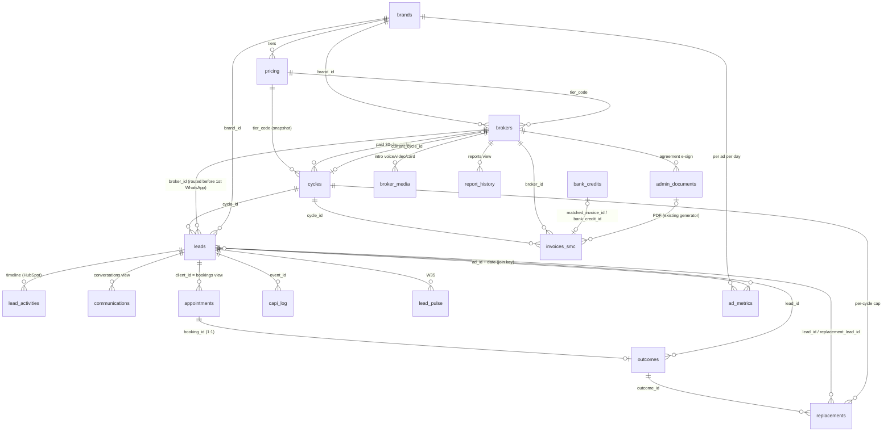

# SortMyCover schema (P2-SCHEMA) — drafted, NOT applied

**Owner:** platform-architect · **Date:** 2026-10-02 · **Status:** migration files only. Nothing is applied to project `cmsylaupctrbsvzrgzwy` until NH-11 (live schema dump) has been diffed and NH-15 is a yes.
**Files:** `supabase/migrations/20261002_smc_01_security.sql` … `20261002_smc_05_rls.sql`, `supabase/seed/smc_synthetic.sql`, `deliverables/platform-architect/security-runbook.md`.
**Rule:** these migrations are additive and extend the existing CRM (0.2, pre-mortem #8). They create new objects only where `build/crm-gap.md` says **new**. SortMyCover rows are those with `brand_id IS NOT NULL`; legacy B2B rows keep `brand_id = NULL`. Adding broker #2 needs one `brokers` row and one `cycles` row. There are no new tables, no new columns and no tenant abstraction (true north).

## Validation performed (local only)
- A **throwaway local PostgreSQL 16** was used, with a Supabase stub: roles `anon`, `authenticated` and `service_role`; `auth.uid()`; `storage.*`; the `extensions` schema; the realtime publication; and Supabase-style default grants.
- All 60 legacy repo migrations were replayed first. That gives 25 legacy tables; the pg_cron migration was skipped because the extension is absent locally.
- Migrations 01→05 were then applied **twice**. Both passes had zero errors, so every statement is idempotent.
- The seed was then applied twice. Without `SET smc.allow_synthetic='on'` it aborts.
- RLS and behaviour checks:
  - **Broker isolation.** A second broker sees 0 leads, messages, cycles and outcomes, and broker 1 sees only his own 10.
  - **Broker write limits.** A broker cannot update SMC lead fields or `brokers.status`.
  - **anon.** Denied on leads, on outcomes and on `smc_erase_lead`.
  - **n8n_app.** Sees SMC rows only, cannot DELETE, cannot write `audit_log`, and can run `smc_erase_lead`.
  - **facts_reader.** Reads `facts.*` and is denied on `public.leads`.
  - **Bookings.** The overlap exclusion constraint rejects a double booking.
  - **Audit log.** It stores `phone` as `[redacted]`.
- `facts.v_watchlist` returns all 7 metrics from the synthetic cycle.
- `node -e` structural checks on all 6 files found:
  - balanced `$$` quotes and parentheses;
  - no `CREATE TABLE|INDEX|SCHEMA|EXTENSION` without `IF NOT EXISTS`;
  - every `CREATE POLICY` inside a `pg_policies` guard;
  - every `CREATE TRIGGER` preceded by `DROP TRIGGER IF EXISTS`;
  - no `DROP TABLE|COLUMN|VIEW|FUNCTION|SCHEMA`;
  - no `public.invoices`, `public.proposals` or `public.notifications`.
- The local cluster lived outside the repo and was deleted afterwards. The live project was never touched, and Supabase MCP was not used.
- **Not validated:** the real Supabase platform (it may differ from the stub) and the live schema (NH-11).

## ERD (core path; ops/facts omitted for readability)

Every write to the tables above (SMC rows only on shared tables) lands in `audit_log` via the `smc_audit()` trigger.

## Name mapping (4.6 / prompt name → what the CRM calls it)
| Prompt name | Physical object | Why |
|---|---|---|
| `brand_id`, `broker_id`, `cycle_id` | `brands.id`, `brokers.id`, `cycles.id` | Repo convention (`id` PK) |
| `practice_name` / `adviser_name` / `adviser_whatsapp` / `calendar_id` | `brokers.firm_name` / `contact_person` / `whatsapp_number` / `calendar_email` | Existing UI reads them (crm-gap A1) |
| `active` | `brokers.active` (generated: `status = 'active'`) | 4.6 flag without a second source of truth |
| `mobile` | `leads.phone` (E.164) | Existing NOT NULL column |
| `event_id` (browser) | `leads.lead_event_id` | Name in `automation/capi/event-spec.md` (cross-agent contract); avoids clash with `capi_log.event_id` |
| `bond`, `dependants`, `work_cover`, `method_pref` | same names (booleans / text) | Task brief; crm-gap's `has_bond`/`has_dependants`/`preferred_method` superseded |
| `consent_mode` (lead) | `leads.consent_mode` = mode in force at capture | crm-gap's `consent_mode_at_capture` |
| `conversations` | view over `communications` (`brand_id` not null) | crm-gap A1: extend INV-T14 |
| `bookings` (`lead_id`, `starts_at`, `source`) | view over `appointments` (`client_id`, `appointment_date`, `booked_via`) | crm-gap A1: extend INV-T24 |
| `reports` (`payload_json`) | view over `report_history` (`report_data`) | crm-gap A3: extend INV-T21 |
| `invoices` | `invoices_smc` | Possible live `public.invoices` (NH-11) |
| `proposals`, `notifications`, `pulses`, `signals`, `quality_grades`, `optimisation_memos`, costs | `ops.*` | NH-16 |
| `signals.limit`, `notifications.to` | `limit_value`, `recipient` | Reserved words |
| `outcomes.quality` / `disposition` / `decided_at` (event-spec) | `quality_score` / `disposition_code` / `marked_at` | 4.12a names |

## Table by table
Counts: **28 new tables** (21 in `public`, 7 in `ops`) plus 1 private key table. **10 existing tables extended.** **4 compatibility views** and `v_cycle_progress`; **9 `facts` views** plus `v_watchlist`. **1 enum.** **14 functions.** **2 roles.**

### Migration 01 — security (NH-15; see `security-runbook.md`)
This migration contains SQL only:
- S1: onboarding PII made admin-only.
- S2: the `appointments`/`broker_notes` `USING (true)` policies replaced.
- S3: the `admin-documents` bucket made private, with a fixed broker download policy.
- **S10** (new finding): dropped permissive "Deny anonymous" policies that let any signed-in broker read every lead and message.
- anon privileges revoked on PII tables.

### Migration 02 — core (crm-gap §D steps 2–5)
| Object | Outcome | Purpose | crm-gap line |
|---|---|---|---|
| `brands` | new | One row per consumer brand: Meta asset ids, `*_ref` secret names, W27 health fields, `booking_ui` list/flow (W28). Seeds SMC (active) and CK (held). | A1 `brands` |
| `pricing` | new | Single price source (3.6). Seeds `SMC_BRONZE` R16,500/20/4/media R8,492, `SMC_SILVER` R24,500/30/6/R12,738 and `SMC_GOLD` R35,500/45/9/R19,108; prices excl. VAT, `vat_rate` NULL. | A1 `pricing` |
| `brokers` | extend INV-T03 | Every 4.6 field, with pre-mortem #12 defaults (Mon–Fri 09–17, 3/day, Teams + phone). Also: `consent_mode` default `named`; `tier_code`→`pricing`; `ref_code` for bank references; onboarding, go-live and ROI fields. The status CHECK is widened to `onboarding · onboarded · ready_for_go_live · active · paused · ended` alongside the legacy values. | A1 `brokers` |
| `cycles` | new | A paid 30-day cycle with a pricing snapshot. Extension is capped at +14 d and shortfall credit at the price (0.1). One `active` cycle per broker. | A1 `cycles` |
| `leads` | extend INV-T04 | Adds linkage, attribution/join keys (event-spec), the consent record, verification and disclosure evidence, the quiz fields, contact data (4.6), and the stage plus `stage_entered_at`. `email` becomes nullable. CHECKs enforce two rules: **`broker_id` must exist before `first_message_at`** (0.2/1.3), and **no SMC lead without consent**. A trigger stamps the stage and `dedupe_hash`. | A1 `leads` |
| `lead_activities` | extend INV-T05 | The one stamped timeline: `workflow` W01–W35, `actor_type`, `payload`, a unique `idempotency_key`. | A1 timeline |
| `communications` → view `conversations` | extend INV-T14 | Adds messenger/instagram channels, the `read` status, LLM/guardrail/template/cost fields, and unique `(channel, external_id)` for wamid idempotency. | A1 `conversations` |
| `appointments` → view `bookings` | extend INV-T24 | Adds method, `graph_event_id`, join/ics, `booked_via`, `schedule_event_id` and reschedule chain. **Zero double-booking** is enforced twice: a partial unique index `(broker_id, appointment_date)` and a gist exclusion on overlapping ranges, both limited to SMC rows with `status IN ('booked','confirmed')`. | A1 `bookings` |
| `outcomes` | new | 4.12a. Enum `smc_disposition_code` = `fit_proceeding, fit_followup, nofit_budget, nofit_covered, nofit_criteria, unreachable`; quality 1–5; one outcome per booking. A generated `replacement_eligible` is true for no-show, `nofit_criteria` or `unreachable`. | A1 `outcomes` (codes corrected to 4.12a) |
| `replacements` | new | W13. A trigger computes `cap_position`/`over_cap` against `cycles.replacement_cap` (**per cycle**, 0.1). An over-cap row cannot be approved or fulfilled without `override_reason`. | A1 `replacements` |
| `invoices_smc`, `bank_credits` | new | Structured money (W16–W19). Reference `LV-{ref_code}-{tier}-{YYYYMM}`; PDF stays in `admin_documents` (INV-G02). Idempotency keys: Graph message id, statement line hash, Paystack ref. | A1 `invoices`, `bank_credits` |
| `admin_documents` | extend INV-T12 | E-sign fields (`kind`, `doc_sha256`, `signed_*`). | A2 agreement |
| `webhook_events` | new | One idempotency table for Meta, WhatsApp, Paystack, Graph and Flow, with a payload hash only. | A1 webhook |
| `audit_log` + `smc_audit()` | new | Append-only. Records actor uid, role, source (`SET smc.source`), reason (`SET smc.reason`) and the diff, with PII values redacted. Covers all SMC tables, and shared legacy tables in brand-scoped mode. | A1 `audit_log` |
| `v_cycle_progress` | new view | Mark's line: committed · verified (replacement leads excluded) · booked · attended · good fit · replacements N/cap · days left. | A1 cycles |

### Migration 03 — ops and reporting (crm-gap §D steps 6–7)
| Object | Outcome | Purpose |
|---|---|---|
| `ad_metrics` | new | W21/W29 per ad per day. Generated CPL, cost per qualified, cost per attended and cost per good-fit; `quality_index`/`quality_n`. |
| `comments` | new | W30. 4.14 intent classes; author stored as a hash. |
| `escalations` | new | Console queue (handoff, disputes, unmatched payments, FSCA mismatch…). |
| `insights` | new | W29 themes (redacted). |
| `lead_pulse` | new | W35. Shown to brokers as aggregates only (no broker RLS on rows). |
| `capi_log` | new | Unique `(event_id, event_name)`; status `skipped_no_consent` for the consent gate. |
| `suppression` | new | Hashes only. `brand_id` NULL means Lead Velocity-wide; unique with `NULLS NOT DISTINCT`. |
| `dsr_requests`, `retention_log`, `incidents`, `obligations` | new | W34 / 2.3 compliance register. |
| `broker_media` | new | Takes and versions; one `is_current` row per kind and language. |
| `report_history` → view `reports` | extend INV-T21 | 4.10a fields: `week`, `report_kind`, `pdf_url`, `sent_*`, `opened_*`, `ask`, `judge_passed`. |
| `message_templates` | extend INV-T15 | Meta name, language, category, status and Flow button; channel adds `whatsapp_cloud`. |
| `sla_thresholds` | extend INV-T18 | Row `smc_first_message` (warn 45 s, critical 60 s). The unique `channel` constraint is untouched. |
| `profiles` | extend INV-T01 | `whatsapp_number` and `notify_dnd` (22:00–07:00) for 6.8b. |
| `ops.pulses`, `ops.proposals` (= 6A2 decision journal), `ops.signals`, `ops.notifications`, `ops.optimisation_memos`, `ops.costs`, `ops.quality_grades` | new | 6.8b / 4.15 / 6A2 #7. |
| `smc_erase_lead()` | new fn | W34: pseudonymise, delete or purge IP/UA in one audited call, logged to `retention_log`. Consent wording and timestamps are kept as evidence (2.1.7). EXECUTE for n8n_app only. |

### Migration 04 — facts (6A2)
Views in schema `facts`, pseudonymised by `lead_key = sha256(salt‖lead id)`. The salt is generated in the database and stored in `smc_private.pseudonym_key`, which has no grants.
- `fact_lead`, `fact_message`, `fact_booking`, `fact_outcome`, `fact_comment` contain no names, numbers, emails, IPs or bodies.
- `fact_cost` takes media from `ad_metrics`, takes everything else from `ops.costs`, and allocates shared cost by lead share.
- `fact_ad_day`, `fact_broker_day` and `fact_cycle` build on those.
- `v_watchlist` holds the seven numbers, overall and per broker: value, target, floor, previous 28 days and n.

Synthetic rows are excluded unless `SET smc.include_synthetic='on'`. The console reads the watchlist through `smc_watchlist()`, which is admin-only. "Ask the data" connects as `facts_reader`, which has SELECT on `facts` only and a 5 s timeout.

### Migration 05 — RLS
**Every new table:**
- RLS on and anon revoked.
- The `smc admin all` policy (`smc_is_admin()` wraps `has_role`, INV-F02).
- The `smc n8n_app rw` policy, with no DELETE grant.

**Brokers (own rows via `smc_current_broker_id()`, INV-A06 pattern):**
- Read: cycles, invoices, replacements, outcomes, media, own SMC timeline, reports and documents.
- Insert/correct: outcomes on own bookings.
- Add: own media takes.

**RESTRICTIVE policies.** Brokers cannot insert or update SMC `leads` or `appointments` rows.

**Trigger `smc_brokers_guard`.** On a broker's own row, it blocks broker changes to status, tier, routing, consent mode, FSP verification, go-live, billing and approved-media fields.

**RPCs:**
- `smc_sign_document` for e-sign.
- `smc_mark_report_opened`.

**n8n_app on shared legacy tables:** `brand_id IS NOT NULL` rows only.

## How workflows write (contract for automation-engineer / billing-automation)
- Before a write, a workflow sets `SET LOCAL smc.source = 'n8n'` and, where a human decided, `smc.reason`. The audit trigger reads both.
- W01–W03 insert `leads` with `brand_id`, `broker_id`, `cycle_id`, `tier_code`, the consent fields and the attribution fields **before** stamping `first_message_at`. The CHECK rejects the reverse order.
- W05 inserts `appointments` with `brand_id`, `method`, `ends_at`, `graph_event_id` and `idempotency_key`. A unique or exclusion violation means the slot was taken, so W05 returns the next 3 slots.
- W12 inserts `outcomes`. W13 inserts `replacements` and reads `over_cap`.
- W16 creates the auth user first, because `brokers.user_id` is NOT NULL (via `auth.admin.createUser` + magic link). It then creates the `brokers` row (`onboarding`), `cycles` and `invoices_smc` (paid), and sets `brokers.current_cycle_id`.
- Every state change also appends a `lead_activities` row (`workflow`, `actor_type`, `idempotency_key`).

## needs_human (append to build/tasks.json via orchestrator — not edited by me)
| Proposed | Item | Default if silent |
|---|---|---|
| NH-11 (still open) | Live-only objects can break or skip these migrations: `invoices`, `proposals`, `notifications`, `whatsapp_history`, RPC bodies of `submit_broker_*`, and real constraint names (`brokers_status_check`, `communications_*_check`, `report_history_status_check`, `message_templates_channel_check`). A live table or view named `conversations`, `bookings` or `reports` would make `CREATE OR REPLACE VIEW` fail, which is loud and safe. | Diff `supabase/live_schema_2026-10.sql` against these files before applying; rename the views if a clash exists |
| NH-15 (still open) | Migration 01 changes live behaviour, including the new **S10** finding: every signed-in broker can read all leads and messages today. | Apply 01 first, alone, after the runbook pre-checks |
| NH-19 (new) | **Watchlist #4 (broker good-fit rate) has no target in the prompt.** | Leave NULL; analytics-reporter proposes a target in `/knowledge/metrics.md` after cycle 1 |
| NH-20 (new) | **Bank reference format.** 3.6 says `LV-{broker_id}-{tier}-{YYYYMM}`; 6.5 says `LV-{broker_id}-{YYYYMM}`. A UUID broker id is likely too long for an FNB reference field (*ASSUMPTION — validate on the first real inContact alert*). | Use `LV-{ref_code}-{tier}-{YYYYMM}` with a 3–8 character `brokers.ref_code`; the matcher keys on `LV-{ref_code}`. A money decision, so it needs a yes |
| NH-21 (new) | **Renewal-risk thresholds and shared-cost allocation** (lead share per day) are ASSUMPTIONS. | Validate at the cycle-1 close against `media_share_zar` |
| NH-22 (new) | **Exposed schemas.** The console reading `ops.*` directly needs `ops` added to the Supabase API exposed schemas (dashboard or `config.toml [api] schemas`). The alternative is RPC wrappers only. `facts` stays unexposed. | Expose `ops` (admin-only RLS already in place) |
| NH-02 (open) | 4.6 workflow 11 still says "cap 3/week"; the schema implements **per cycle** (0.1). | Per cycle |
| — | crm-gap A1 listed disposition codes as `good_fit_*`/`not_fit_*`; 4.12a's `fit_*`/`nofit_*` codes are implemented. crm-gap should be corrected by its owner (me) in the next gap-map pass. | 4.12a wins |
| — | Quiz copy in 4.5 shows the age band "50+"; 0.1 says `51+`. The schema uses `51plus`. | 0.1 wins |

## Pass 2 (2026-10-02) — `20261002_smc_06_pass2.sql` + `20261002_smc_07_pass2_rls.sql` (drafted, NOT applied)
Implements build/integration-pass2.md I-04 and I-14; I-13 is runbook §E. Additive; disposition codes unchanged (4.12a, I-01).

| Owner request | What 06 adds |
|---|---|
| broker-success (portal README) | `brokers.first_login_at, last_seen_at, onboarding_completed_at, onboarding_last_progress_at, onboarding_nudges, preflight_card, preflight_run_id, practice_legal_name, signatory_name/role, fb_page_name/id, calendar_mode, calendar_status, calendar_connected_at, next_free_slot_at`; `report_history.edition` (+ appended to `reports`); `support_events` (new); `lead_activities.lead_id` was already nullable (02). RPCs `smc_portal_touch`, `smc_portal_event` (portal → timeline outbox for W20, no secret in the browser), `smc_report_ask_done`. Broker guard extended to onboarding/calendar/billing fields. |
| W20 (4.6 names) | Read-only generated aliases `brokers.broker_id/adviser_name/practice_name/adviser_whatsapp`; audit PII list extended so aliases never reach `audit_log`. |
| billing (NH-BA-05/NH-26) | `brokers.billing_ref` (1–999999, sequence, SMC rows only), `next_tier_code`, `paystack_subscription_code/_token_ref`, `paystack_authorization_ref`; status + `invited/prospect/not_renewed`; `pricing.ref_code` B/S/G + `pg_notify('pricing_changed')`; `cycles.invoice_id` (unique), `cycles.cycle_id` alias, nullable start/end until routing, fill trigger (brand, cycle_no, pricing snapshot, previous cycle); `invoices_smc.charge_attempts/last_charge_failed_at/last_charge_error`, `total_zar` now trigger-enforced (= amount + VAT) instead of generated, `invoice_no`/`brand_id` auto-filled, amount 0 allowed when credited; `bank_credits.external_id, duplicate_of, queue_reason, queue_suggestions, statement_confirmed_at, statement_external_id`; `ops.billing_reports`, `ops.billing_actions_log`. |
| intro-media | `appointments.intro_arm, intro_sent_at, intro_read_at, intro_played_at, late_booking` (+ appended to `bookings`); `broker_media.state` (generated from `ai_check.state` + approval); `broker_media.url` nullable while processing. |
| ads-api | `brands.insights_last_fetched_at, health_alerts` + aliases `brand_id`, `status`; `message_templates.status_synced_at, rejected_reason`; `ops.notifications.body`; `ad_objects` cache + view `ads`; `creative_queue`; non-partial unique on `leads.leadgen_id`; `leads.qualified` generated boolean. |
| community | `comments.status, due_at, attempts, decision` + indexes + unique `comment_id`; `comment_ad_sentiment`; `dm_queue`; **`dm_threads`** (the request targeted `conversations`, which is a per-message view — W31 must rename); `escalations.assigned_agent` + new kinds. |
| W22 | `ops.notifications` W22 columns (`"to"` synced with `recipient`, severity, status, dedupe/escalation fields), widened kind list; `ops.secret_inventory`, `ops.backup_runs`, `ops.infra_day`, `ops.page_day`, `ops.page_audits`; `ops.w22_metrics` with the funnel branches. |
| W24 | `suppression.source` + `deletion`, unique `(mobile_hash, source)`; `dsr_requests.mobile_hash`; `obligations.status` + green/amber/red, `obligations.note`. |
| analytics | Appended contract columns on `fact_lead, fact_booking, fact_outcome, fact_ad_day, fact_broker_day, fact_cost (cycle_id), fact_cycle (renewed, tier_name)`; new `fact_system_day, fact_lead_theme, fact_broker_roi` (no facts_reader grant), `fact_page_day`, `v_watchlist_daily`. |
| optimisation (I-14) | sql-additions.sql applied idempotently; `ops.settings`, `ops.judge_runs`, `ops.build_state` + `ops.build_state_latest`, `ops.alert_recipients`; `facts.pulse_daily` (daily + rolling 7-day numerator/denominator); `ops.redact`, `ops.judge_samples(date)`, `ops.proposal_actuals(date)`, `ops.notifications_due()`; console RPC `smc_watchlist_tiles()`. |

Also: non-partial unique twins for every partial unique index used as an `ON CONFLICT` target (lead_activities, bank_credits x2, appointments x2, leads.leadgen_id) — found by EXPLAIN-checking the workflows. 07: RLS/grants for all new tables, views and functions (same model as 05).
**Changed in 02/03/04:** the `bookings`, `reports` and seven `facts.fact_*` view statements are wrapped in a guard that skips them once 06's appended column exists, so re-running the chain cannot try to shrink a view.
**pulse_daily gaps (no source yet):** quiz_step_dropoff_max, time_to_brief_min, renewal_risk, branded_search_wow, serp_ownership, waba_quality.

## Pass 3 (2026-10-02) — `20261002_smc_08_pass3.sql` (drafted, NOT applied)
Additive and idempotent. Validated on a local Postgres 16 stub only: 01→08 applied twice, synthetic seed twice, analytics SQL, and the workflow parse-check (155 statements, same 7 untyped-parameter artefacts as before 08, no new errors).

| Item | What 08 does |
|---|---|
| I-28 | Tries `GRANT USAGE ON SCHEMA auth` and `EXECUTE ON auth.uid()` to `n8n_app`. If the hosted project refuses, the migration logs a WARNING and does not fail. Vault is reached only through SECURITY DEFINER wrappers, which only `n8n_app` can EXECUTE: `smc_vault_store_paystack_auth(broker_id, authorization_code, customer_code)` (W16), `smc_vault_store_paystack_sub(customer_code, subscription_code, email_token)` (W16 plan mode) and `smc_vault_paystack_auth_code(broker_id)` (W19). `n8n_app` has no vault grants. *ASSUMPTION — validate after NH-15:* hosted Supabase gives a custom role nothing on `auth` or `vault`. |
| I-24 | The partial unique index `broker_media_one_current` is replaced by the constraint `broker_media_one_current_x`, an `EXCLUDE … WHERE (is_current)` that is DEFERRABLE INITIALLY DEFERRED. The rule is the same, but it is checked at commit, so W23's one-statement demote and promote works. |
| I-25 | `escalations_kind_check` adds `sensitive`, `dm_handoff` and `dm_after_link`. |
| I-19 / I-22 | New table `ops.watchlist_targets`, admin-only RLS, audited. It is seeded with the NH-25 defaults: #1 R1,300 with a R900 stretch, #4 60%. A re-run never overwrites an edit. `facts.v_watchlist` reads its targets and floors from this table, and tile 4 now excludes `unreachable`. `facts.fact_broker_day` is rewritten as grouped joins: same 18 columns, and output identical to 06 on the fixture (EXCEPT both ways = 0). |
| I-30b | `smc_sign_document` takes the signer IP from `request.headers` (first `x-forwarded-for`, else `x-real-ip`). The value must parse as `inet`, otherwise it is stored as NULL. The source goes in `admin_documents.signer_ip_source`. `p_signer_ip` is ignored. |
| I-30c | New column `admin_documents.acceptances` (jsonb object), written once by the new 6-argument `smc_sign_document(…, p_acceptances)`. The repo has no `admin_documents.metadata`. |
| I-30d | `smc_report_policies_written(p_count, p_cycle_id?)` lets a broker set `cycles.policies_written_reported` on his own cycle (current cycle by default, 0–1000). It also writes a `lead_activities` row of type `policies.reported`. |
| I-30i | `smc_faculty_tiles(p_days, p_include_synthetic)` is admin-only and returns, per faculty and metric, the latest value, the 7-day value, n, the value 7 days earlier and a trend. It reads `facts.pulse_daily`. |
| NH-22 default | Admin RPCs (has_role check inside each): `smc_console_pulses`, `_signals_open`, `_quality_grades`, `_judge_runs`, `_build_state`, `_proposals`, `_decide_proposal` (status + W32 `approval` outbox row in one transaction), `_proposal_from_grade`, `_watchlist_targets`, `_set_watchlist_target`. The console no longer needs `ops` in the exposed schemas. |

Stub tests (rolled back):
- `n8n_app` broker update: works with the grant, fails without it.
- Vault wrappers: store, read back and plan-mode re-run all work. `n8n_app` cannot read vault directly, and `authenticated` cannot call the wrappers.
- `broker_media` swap: passes. A real duplicate is still rejected.
- Escalation kinds: pass.
- `smc_sign_document`:
  - stores the forwarded IP;
  - stores NULL for a spoofed non-IP header;
  - refuses a second signature;
  - writes acceptances.
- Policies written: the value and the timeline row are written, and a negative count is refused.
- Admin RPCs: every one returns rows for an admin. A broker gets `admin only` from each, and anon gets permission denied.

### Pass 3 addendum — I-33d (in 08 §12)
`smc_brokers_guard` checks `current_user` first, in its own IF, before `auth.uid()`. As a result, `n8n_app`, service and SECURITY DEFINER paths never call `auth.uid()`, and updates keep working even if the hosted project refuses the §1 grant. Stub test: the `n8n_app` update succeeds with `auth` access revoked, and a broker's own `status` change still gets 42501.

## Pass 4 (2026-10-02) — `20261002_smc_10_pass4.sql` (drafted, NOT applied)
Additive and idempotent. Validated on the local stub only. Results:
- Chain 01→10 applied twice with 0 errors, and 0 legacy errors.
- Seed applied twice with 0 errors.
- Analytics SQL (including `W14-broker-payload.sql`) ran with 0 errors.
- Workflow parse-check: 221 statements, 7 errors, all untyped-parameter artefacts. The `wa_threads`, `ctwa_clicks` and `w14_broker_report` errors are gone.

| Item | What 10 does |
|---|---|
| I-34a | **`public.wa_threads`**: PK `(brand_id, mobile_hash)` plus `state jsonb` (object), `stage`, `last_inbound_at`, `stall_due_at` (partial index), `expires_at` (index) and `updated_at`. RLS is on. Only `n8n_app` can access it (SELECT, INSERT, UPDATE, and DELETE for the 72 h expiry purge by W34); there are no grants to anon or authenticated. **`ops.ctwa_clicks`**: `(id, ref ≤ 200 chars, clicked_at, ua_class ∈ ios/android/desktop/bot/other)` and no IP, user agent or cookie. `n8n_app` may only insert; admins read under RLS. |
| I-34a (withdrawn) | **Not created, on purpose:** `leads.lead_token_hash`, `leads.lead_token_expires_at` and any `flow_tokens` table. The lead token is a stateless HMAC (CONTRACTS.md, I-29). |
| I-33g | `brokers.close_rate` is a fraction from 0 to 1. Any value above 1 is first divided by 100. The new CHECK `brokers_smc_close_rate_fraction` then enforces 0–1, alongside 02's looser 0–100 check. Stub: 30 becomes 0.30 on re-run, and writing 30 is refused. |
| I-33i | `facts.vtl`, `facts.w14_broker_report(uuid, date, text)`, `facts.w14_reconcile(uuid, jsonb)` and `facts.w14_hold(uuid, jsonb)` are copied verbatim from `analytics/W14-broker-payload.sql`, and `facts.w14_lv_payload()` from `analytics/W14-lv.sql`. They are created with `check_function_bodies = off` because they depend on the analytics layer. They are then altered to SECURITY DEFINER with a pinned search_path; only `n8n_app` may EXECUTE them. `ALTER DEFAULT PRIVILEGES IN SCHEMA facts GRANT SELECT ON TABLES TO n8n_app`, so the analytics views also work when the analytics files are re-run. Stub results as `n8n_app`: the report has 16 keys, `hold` is false, reconcile runs 20 checks with 0 failing, and the LV payload has 9 keys. A broker gets permission denied. |

No new browser-facing RPC, so `smc-types.ts` is unchanged.

**needs_human (proposed):** the analytics layer has no migration. That covers `params.sql`, `watchlist.sql`, `kill-scale.sql`, `W14-broker.sql` and the `v_w14_lv_*` views in `W14-lv.sql`, which hold `facts.v_params`, `cycle_counts`, `renewal_risk_at` and the tile views. The functions in 10 exist but fail at call time until those files are applied. There are two options: fold the layer into a migration 11 (analytics-reporter owns the content, and `params.sql`'s `DROP VIEW … CASCADE` must become CREATE OR REPLACE first), or make the deploy runbook apply `analytics/*.sql` after the migrations. Default: runbook step, until analytics-reporter removes the CASCADE.

## Pass 5 (2026-10-02) — `20261002_smc_11_pass5.sql` (drafted, NOT applied)
This migration contains only the two items below. Stub run: chain 01→11 twice with 0 errors, 0 legacy errors, seed twice and analytics with 0 errors. The workflow parse-check found 227 statements and 7 distinct errors, all of them untyped-parameter artefacts; the one new artefact is in W08, which another agent added.

| Item | What 11 does |
|---|---|
| I-37g | `ops.notifications.attempts integer NOT NULL DEFAULT 0`, plus a CHECK that it is ≥ 0. |
| I-35i | `smc_vault_paystack_sub_token(broker_id)`: a SECURITY DEFINER function that only `n8n_app` can run. It returns the decrypted Paystack subscription email token named in `brokers.paystack_subscription_token_ref`, whether or not `card_autorenew` is on, so W19 can disable the Plan when the broker switches auto-renew off. Stub result: token stored by `smc_vault_store_paystack_sub` → read back. `authenticated` gets permission denied. |

## Pass 6 (2026-10-02) — `20261002_smc_12_pass6.sql` (drafted, NOT applied) — I-38a
Stub run, chain 01→12:
- Applied twice, plus the seed twice and the analytics SQL: 0 errors, and 0 legacy errors.
- Workflow parse-check: 251 statements. The only real error is W34 "Clear residual identifiers" (`lr.name` does not exist). The rest are untyped-parameter artefacts.
- `node --test automation/tests/W34.test.mjs`: 18/18 pass, 0 todo.

| Item | What 12 does |
|---|---|
| Kinds | `notifications_kind_check` adds `dsar` (W34 "Record DSR", "Queue DSR clock tickets") and `approval_confirmed` (W32 "Confirm to approvers"). Before 12, these were the only two kinds that workflows insert directly and the check rejected. Also added defensively: `approval_stuck`, `card_autorenew_off`, `dsar_received`, `dsar_due`, `dsar_overdue`, `dsar_erased`, `broker_dsr_erase`, `w34_retention_failure`, `w34_monthly_report`. These are W22 alert kinds, which W22 stores as `alert` + `signal_key`. |
| Erase | `smc_erase_lead` (same signature) also clears these, each only when the column exists on the database (NH-11): `leads.name`, `leads.company`, `leads.role`, and `appointments.meeting_link`, `notes`, `reason_notes`. `lead_conversations` messages become `[erased]` on pseudonymise and are deleted on delete. |
| Hash | `smc_hash_contact` uses one rule: a phone is hashed as SHA-256 hex of its E.164 digits only, with no "+", spaces or dashes. W24 and W15 already hash this way in code. An email is hashed as lower(trim). A local `0…` number is not rewritten. The old rule is kept as `smc_hash_contact_v1`, used only to find old hashes. A one-off re-hash recomputes `leads.dedupe_hash`, plus `suppression.mobile_hash`, `dsr_requests.mobile_hash` and `dsr_requests.subject_hash` where they match the old rule and the lead's phone is still present. Pre-launch this touches synthetic rows only. `wa_threads` hashes expire within 72 h. |
| Register | `obligations` P7 (DSR in 30 days) and P8 (retention purge) are seeded from compliance-register.md with status `open`. A re-run never overwrites them. |

Stub tests:
- `'+27 82 000-0000'` hashes to sha256(`27820000000`); `' A@B.co '` hashes to sha256(`a@b.co`).
- All 10 SMC leads were re-hashed.
- `dsar` and `approval_confirmed` inserts are accepted.
- Pseudonymise as `n8n_app` clears company and role, sets the conversation to `[erased]`, and clears `reason_notes`.

**For the W34 owner (I-38b):** the "Clear residual identifiers" node (job 3b) is now redundant and also references `leads.name`, which this repo does not have. Drop the node, since `smc_erase_lead` now covers those columns.
